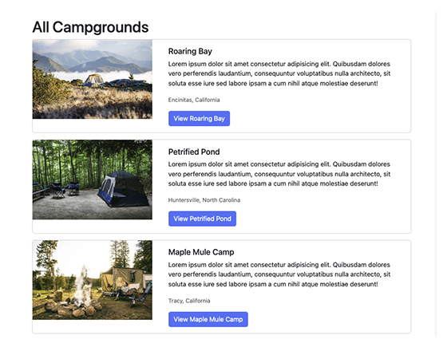

# YelpCamp Database Seed Script

To be used with with Colt Steele's YelpCamp project, from the 'Web Developer Bootcamp' course.
https://www.udemy.com/course/the-web-developer-bootcamp/

Attempts to improve the 'seed database' script used by Colt.

- Instead of using one random image that repeats in every campground, requests a different image for every campground.

- Creates 3 toy users: 'alice', 'bob' and 'charlie', with passwords equal to their names.

- Creates up to 200 campgrounds (50 by default). Each campground is created by one of the users, so we can test authentication and authorization.

---



## Configuration

You need to provide some environmental variables. You can do so by creating an `.env` file at the root of this directory, or by editing `/helpers/fallbackConfig.js`.

At the very least you will need to provide the `UNSPLASH_API_KEY`. Set up an Unsplash Developer API to get it: https://unsplash.com/developers

You can leave `LOCAL_DB_URL` and `SESSION_CONFIG_SECRET` as they are.

You don't need to provide `MONGO_URL` and `MONGO_DB_NAME` if you are not using a cloud database (i.e. you are following the bootcamp from the beginning), but you will get an error if you run the script with the 'remote' option.

The script will try to use .env first, then fallbackConfig.js.

`.env` example
```
MONGO_URL=""
MONGO_DB_NAME=""
UNSPLASH_API_KEY=""
LOCAL_DB_URL="mongodb://localhost:27017/yelp-camp-2024"
SESSION_CONFIG_SECRET="youWillNeverGuess"
```

`fallbackConfig.js` example
``` js
const fallbackConfig = {
  MONGO_URL: 'fakeUrl',                   // optional unless seeding cluod db
  MONGO_DB_NAME: 'fakeDbName',            // optional unless seeding cloud db
  UNSPLASH_API_KEY: '',                   // NEEDED, get one at https://unsplash.com/developers
  LOCAL_DB_URL: 'mongodb://localhost:27017/yelp-camp-2024',   // you may leave this
  SESSION_CONFIG_SECRET: 'youWillNeverGuess',                 // you may leave this
};
```

## Usage

Once configuration is done, you may run:

```
npm install
```

Then...

To seed local database:

```
node seed.js local
```

To seed cloud database (Atlas):

```
node seed.js remote
```

Pass a second argument to specify the number of campgrounds
Default is 50, maximum is 200 (should be an int).
To create 100 campgrounds run:

```
node seed.js local 100
```

## Known issues:

- On "Section 54: Image Upload - Lecture 557: Adding a Thumbnail Virtual Property" you will create a virtual property on the Campground model to display thumbnails of your uploaded images. This virtual property uses a Cloudinary URL, which is different from Unsplash thumbnail URLs. Because of this, thumbnails seeded with this script won't display correctly.
